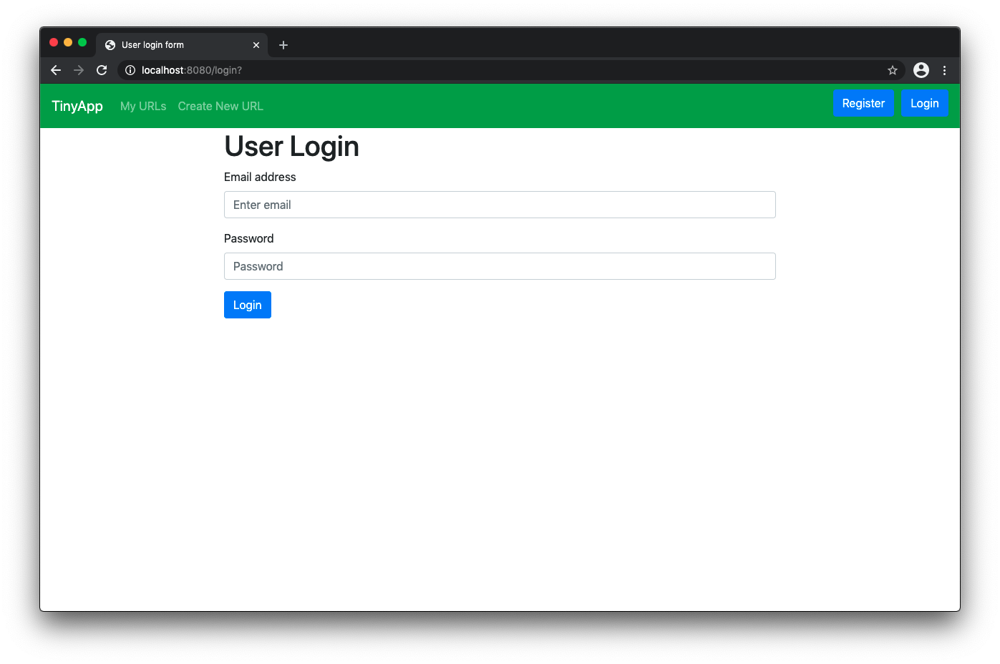
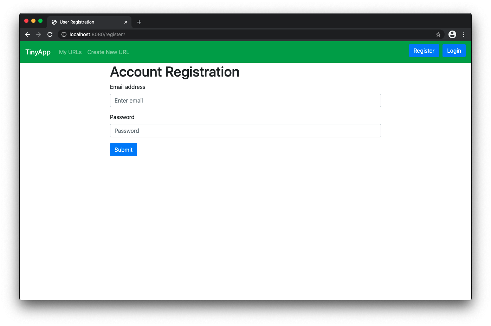
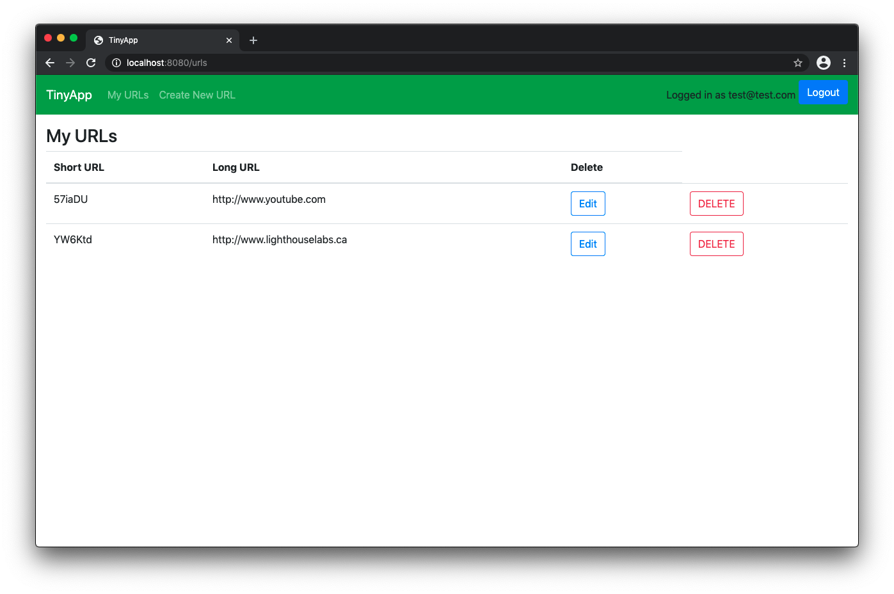
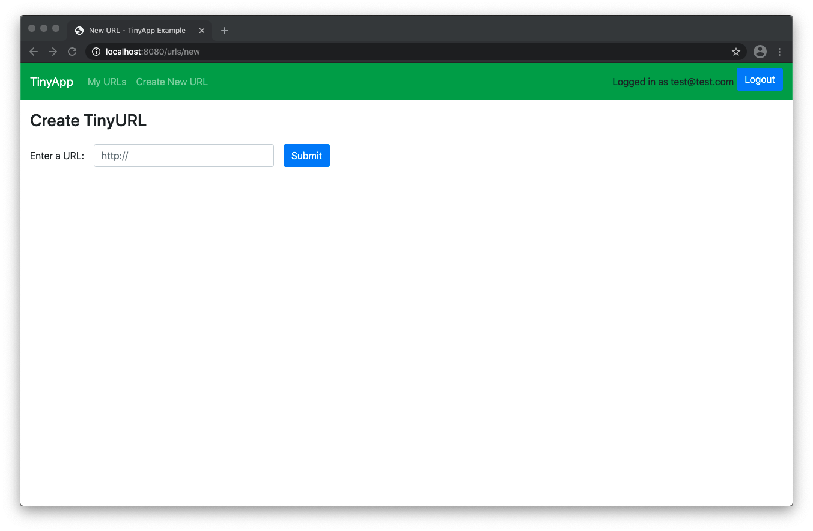
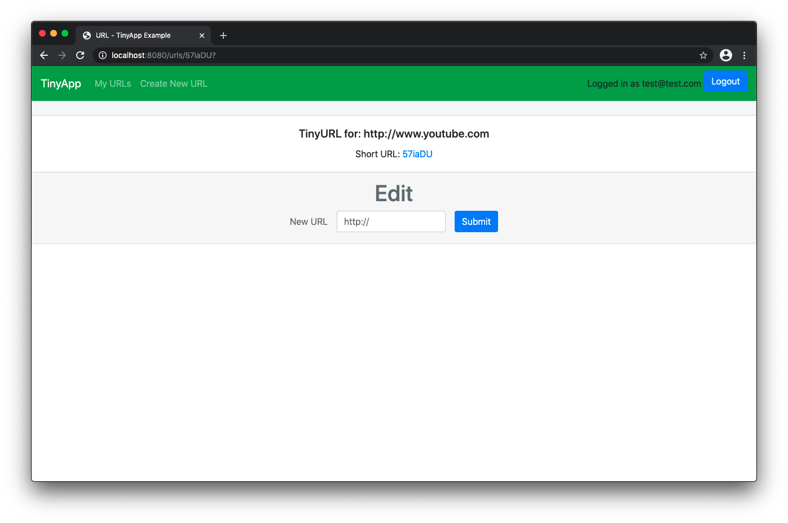

# TinyApp Project

TinyApp is a full stack web application built with Node and Express that allows users to shorten long URLs (à la bit.ly).

## Final Product

* Login Page: Can only sign in to existing accounts

* Account Registraion: Email addresses must be unique.

* Urls Page: you will only be able to see urls that you have created

* Create New URLs: This page will take in a URL you choose and produce a 6 character shorter URL that is linked to the original URL as well as your unique user identifier so you can access it later.

## Dependencies

- Node.js
- Express
- EJS
- bcrypt
- body-parser
- cookie-session

## Getting Started

- Install all dependencies (using the `npm install` command).
- Run the development web server using the `node express_server.js` command.